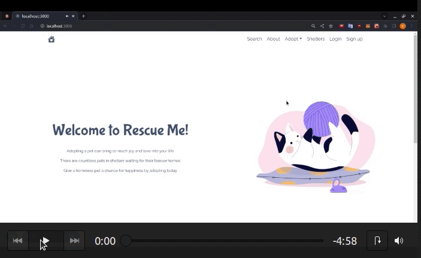

# Pet_Adoption_RescueMeApp

RescueMe PetAdoption is  a web-based application created as the final project of a full-stack web development course. 
check it here ->  https://rescuemedemofinal.vercel.app/
## Technologies Used

### Frontend

  

### Backend

    

## About 

## Visiting RescueMe

To get started with RescueMe , please follow these steps:

1. npm install -g yarn
2. run command : yarn start for client and for server

----------------------------------------------------------------------------------------------------------------------------------------------------

1. Register through the registration form, adding your  name, desired profile either Individual or Shelter, E-mail and password.
2. Search for pets with the help of various filters, add pet to a favorite list.
4. Post a pet for adoption.
5. Search for shelters by city.
6.  you can change your profile information and photo in the settings

Watch the full presentation here:

<a href="https://www.loom.com/share/459baa356c4c4e5a967ad624b4fb49df">
    
RescueMe_PetAdoption_WebApp - Watch Presentation Video

    
  </a>
## Contributors and Contacts

- Sorina - [GitHub](https://github.com/verdeverzi). 
- Giselle - [GitHub](https://github.com/GiselleAnido)
- Lia - [GitHub](https://github.com/LiaGrozav)
- Elaine - [GitHub](https://github.com/elainealso)

Thank you for your interest in RescueMe!

